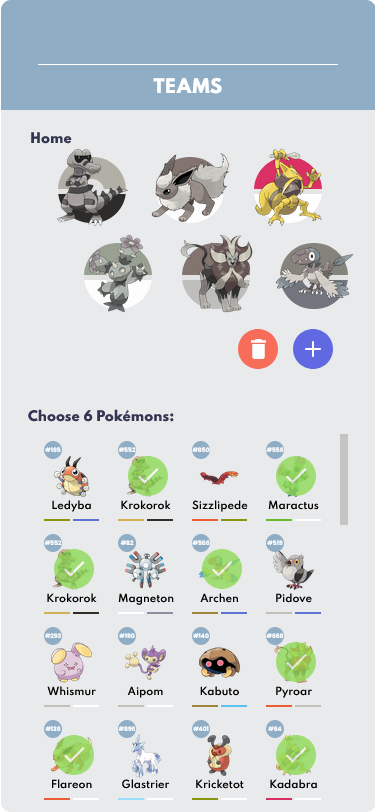
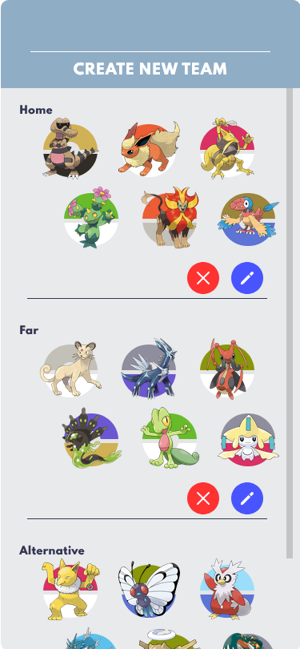

# 👾 Pokemon Team Builder

### 🕹️ Test it yourself: https://pokemon-team-builder-five.vercel.app/

---

## 🖥️ Screens:

  

---

## 🛠️ Tecnologies:

- Typescript
- React
- Styled Components
- Redux Toolkit
- Axios

---

## ⚙️ Installation:

1. First, if you dont have Git installed, download the zip file and extract him. If you have, clone the repository:

	```sh
	git clone https://github.com/rafaelfreire09/Pokemon-Team-Builder.git
	```

2. Inside the project, install the necessary dependencies to run.

	```sh
	npm install
	```

	or

	```sh
	yarn install
	```

3. To run:

	```sh
	npm start
	```

	or

	```sh
	yarn start
	```

4. Open http://localhost:3000 to view it in the browser.
